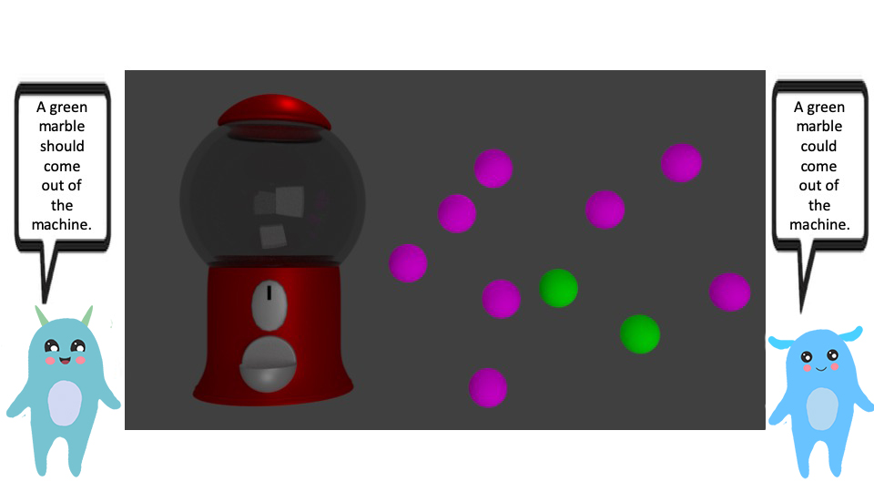

```{r stimulus, echo=F, fig.cap="Sample experimental stimulus", out.width="75%"}
#
knitr::opts_chunk$set(echo=F, warning=F, message = F)
```

```{r data, echo=F}
d <- read.csv('data_anonymized/dev_modals_exp3_data.csv')
d$age_group <- factor(d$age_group, levels=c('child', 'adult'))
d$age_group <- relevel(d$age_group, ref='child')
d$prob.label <- ordered(d$prob.label, levels=c('0%\nProbability', '20%\nProbability', '80%\nProbability', '100%\nProbability'))
d$modal_pair <- ordered(d$modal_pair , levels=c('wont-could', 'wont-should', 'could-should', 'could-will', 'should-will'))
d <-d[!is.na(d$selected_modal),]
```

# Participants

Three age groups of children, one adult sample
```{r demogs, echo=F, message=FALSE, warning=FALSE}
source('00_modals-resource.R')
d %>%
    distinct(partID, .keep_all=T) %>%
    filter(#age_group=='child',
           age>0) %>%
    group_by(age_group) %>%
    dplyr::summarize(N=n(),
            mean = mean(age, na.rm=T),
            min  = min(age, na.rm=T),
            max  = max(age, na.rm=T),
            sd   = sd(age, na.rm=T),
            ci.low = mean - ci.low(age, na.rm=T),
            ci.hi  = mean + ci.high(age, na.rm=T)) %>%
  kable(., caption='Gen. 3 Participant Demographics', align='c') %>%
kable_styling(., "striped", full_width = F)
```
```{r demogs-binned, echo=F, message=FALSE, warning=FALSE}
d %>%
    distinct(partID, .keep_all=T) %>%
    group_by(age_bin) %>%
    dplyr::summarize(N=n(),
            mean = mean(age),
            min  = min(age),
            max  = max(age),
            sd   = sd(age),
            ci.low = mean - ci.low(age),
            ci.hi  = mean + ci.high(age)) %>%
  kable(., caption='Gen. 3 Participant Demographics by Age Group', align='c') %>%
kable_styling(., "striped", full_width = F)
```

# Modal Selection

Visualizing modal selection rates across trials
```{r stacked-bar, echo=FALSE, fig.height=8, fig.width=10, message=FALSE, warning=FALSE}
stacked_bar_df <- d %>%
  select(age_bin, modal_pair, prob.label, wont, could, should, will) %>%
  group_by(age_bin, modal_pair, prob.label) %>%
  dplyr::summarise(wont = mean(wont, na.rm=T),
                   could=mean(could, na.rm=T),
                   should=mean(should, na.rm=T),
                   will=mean(will, na.rm=T)) %>%
  gather(modal, mean, -age_bin, -modal_pair, -prob.label) %>%
  filter(mean > 0) %>%
  group_by(age_bin, modal_pair, prob.label)

stacked_bar_df$modal <- ordered(stacked_bar_df$modal , levels=c('wont', 'could', 'should', 'will'))
  
  ggplot(stacked_bar_df, aes(x=modal_pair, y=mean, fill=modal)) +
    geom_bar(stat='identity') +
    geom_hline(yintercept=0.5, lty=2, color='gray10')+
    facet_grid(cols=vars(age_bin), rows=vars(prob.label), 
               drop=T, scales='free') +
    modals.barplot.theme.sans +
    scale_fill_manual(values=modal.colors3,
                      name='Modal') +
  labs(x='Modal Pair', y='Mean Selection', 
       title='Epistemic Modal Preference by Age and Outcome Probability')

ggsave("exp3-stacked-barplot.png", device = "png", 
       path = "plots/",
       scale = 1, width = 10, height = 8, units = "in")
```

```{r lineplot, echo=FALSE, fig.height=8, fig.width=10, message=FALSE, warning=FALSE}
s.df <- d %>%
  select(age, age_group, modal_pair, prob.label, wont, could, should, will) %>%
  gather(modal, selection, -age, -modal_pair, -prob.label, -age_group) %>%
  group_by(age_group, modal_pair, prob.label) 
  
s.df$relevant <- 0
s.df$relevant[s.df$modal_pair == 'wont-could' & s.df$modal=='wont'] <- 1
s.df$relevant[s.df$modal_pair %in% c(
  'wont-could', 'could-should', 'could-will') & s.df$modal=='could'] <- 1
s.df$relevant[s.df$modal_pair %in% c('wont-should',
  'should-will', 'could-should') & s.df$modal=='should'] <- 1
s.df$relevant[s.df$modal_pair %in% c(
  'should-will', 'could-will') & s.df$modal=='will'] <- 1

s.df <- s.df[s.df$relevant==1,]

sa.df <- s.df %>%
  filter(age_group=='adult') %>%
  group_by(modal_pair, prob.label, modal) %>%
  dplyr::summarise(mean = mean(selection)) %>%
  filter(mean > 0)

s.df %>%
  filter(age_group=='child',
         relevant==1) %>%
  ggplot(., aes(x=age, y=selection, color=modal, group=modal)) +
    geom_count(size=.5) +
  stat_smooth(method='lm') +
    #geom_hline(data=sa.df, yintercept=mean)+
    geom_hline(yintercept=0.5, lty=2, color='gray10')+
    facet_grid(cols=vars(prob.label), 
               rows=vars(modal_pair), drop=T, scales='free') +
    modals.lineplot.theme.sans +
    scale_color_manual(values=modal.colors3,
                      name='Modal') +
  labs(x='Age (years)', y='Mean Selection', 
       title='Epistemic Modal Preference by Age and Outcome Probability')

ggsave("lineplot_exp3.png", device = "png", 
       path = "plots/",
       scale = 1, width = 10, height = 8, units = "in")
```

## Comparisons to Chance
```{r adult-means, echo=F, message=FALSE, warning=FALSE, paged.print=FALSE}
means.df <- d %>%
  dplyr::select(age_group, modal_pair, proportion, partID, will, would, wont, should, could) %>%
  gather(modal, selection, -partID, -modal_pair, -proportion, -age_group) %>%
  group_by(age_group, modal_pair, proportion, modal, partID) %>%
      dplyr::summarise(ppmean = na.mean(selection)) %>%
  group_by(age_group, modal_pair, proportion, modal) %>%
      dplyr::mutate(n = n(),
            mean = mean(ppmean),
            ciLow = mean - ci.low(ppmean),
            ciHi = mean + ci.high(ppmean)) 

a.df <- means.df %>%
  filter(age_group =='adult',
         mean > 0) %>%
  distinct(proportion, modal_pair, modal, mean, ciLow, ciHi) 

kable(a.df, caption='Adult Modal Selection Means and 95% CIs') %>%
  kable_styling() %>%
  row_spec(which(a.df $ciLow>.5), background='lightgreen')

at.df <- means.df %>%
  filter(age_group =='adult') %>%
  filter(mean > 0,
         mean < 1) %>%
  group_by(proportion, modal_pair, modal, n, mean, ciLow, ciHi) %>%
      summarise(
            df = t.test(ppmean, mu = .5)$parameter,
            tStat = t.test(ppmean, mu = .5)$statistic,
            pVal = t.test(ppmean, mu = .5)$p.value)
kable(at.df, caption='Adult Modal Selections Comparisons to Chance*') %>%
  kable_styling() %>%
  row_spec(which(
    at.df$pVal<.05 & at.df$mean>.5), background='lightgreen', bold=T)%>%
  footnote(general='Two-sided t-tests are computed on by-participant means (rather than across all individual trials).',
           symbol=c('Chance = 0.5', 'Trials with no variance in adult response are not analyzed'))
```

```{r child-means, echo=F, message=FALSE, warning=FALSE, paged.print=FALSE}
c.df <- means.df %>%
  filter(age_group =='child') %>%
  distinct(proportion, modal_pair, modal, mean, ciLow, ciHi) 

kable(c.df, caption='Child Modal Selection Means and 95% CIs') %>%
  kable_styling() %>%
  row_spec(which(c.df $ciLow>.5), background='lightgreen')

ct.df <- means.df %>%
  filter(age_group =='child') %>%
  filter(mean > 0) %>%
  group_by(proportion, modal_pair, modal, n, mean, ciLow, ciHi) %>%
      summarise(
            df = t.test(ppmean, mu = .5)$parameter,
            tStat = t.test(ppmean, mu = .5)$statistic,
            pVal = t.test(ppmean, mu = .5)$p.value)
kable(ct.df, caption='Child Modal Selections Comparisons to Chance*') %>%
  kable_styling() %>%
  row_spec(which(ct.df$pVal<.05 & ct.df$mean>.5), background='lightgreen', bold=T)%>%
  footnote(general='Two-sided t-tests are computed on by-participant means (rather than across all individual trials).',
           symbol='Chance = 0.5')
  
```

## Adult-like Responding

```{r modplot-calc}
d$modal_pair_unordered <- factor(d$modal_pair, ordered=F)
mod <- glm(adultlike ~ (proportion + age + modal_pair_unordered)^2,
               family='binomial', d[d$age_group=='child' & d$modal_pair_unordered!='wont-should',])

b0 <- mod$coef[1] # intercept
X1 <- mod$coef[2]
X2 <- -mod$coef[3]
groupb <- mod$coef[4]
groupc <- mod$coef[5]
groupd <- mod$coef[6]
X1.X2 <- mod$coef[7]
X1.groupb <- mod$coef[8]
X1.groupc <- mod$coef[9]
X1.groupd <- mod$coef[10]
X2.groupb <- mod$coef[11]
X2.groupc <- mod$coef[12]
X2.groupd <- mod$coef[13]

X1_range <- seq(from=0, to=100, by=.1)

X2_val <- mean(d[d$age_group=='child',]$age) # by plugging in the mean as the value for X2, I'll be generating plots that show the relationship between X1 and the outcome "for someone with an average X2".

a_logits <- b0 + 
  X1*X1_range + 
  X2*X2_val + 
  groupb*0 + 
  groupc*0 + 
  X1.X2*X1_range*X2_val + 
  X1.groupb*X1_range*0 + 
  X1.groupc*X1_range*0 + 
  X2.groupb*X2_val*0 + 
  X2.groupc*X2_val*0 # the reference group

b_logits <- b0 + 
  X1*X1_range + 
  X2*X2_val + 
  groupb*1 + 
  groupc*0 + 
  X1.X2*X1_range*X2_val + 
  X1.groupb*X1_range*1 + 
  X1.groupc*X1_range*0 + 
  X2.groupb*X2_val*1 + 
  X2.groupc*X2_val*0

c_logits <- b0 + 
  X1*X1_range + 
  X2*X2_val + 
  groupb*0 + 
  groupc*1 + 
  X1.X2*X1_range*X2_val + 
  X1.groupb*X1_range*0 + 
  X1.groupc*X1_range*1 + 
  X2.groupb*X2_val*0 + 
  X2.groupc*X2_val*1

d_logits <- b0 + 
  X1*X1_range + 
  X2*X2_val + 
  groupb*0 + 
  groupd*1 + 
  X1.X2*X1_range*X2_val + 
  X1.groupb*X1_range*0 + 
  X1.groupd*X1_range*1 + 
  X2.groupb*X2_val*0 + 
  X2.groupd*X2_val*1

# Compute the probabilities:
a_probs <- exp(a_logits)/(1 + exp(a_logits))
b_probs <- exp(b_logits)/(1 + exp(b_logits))
c_probs <- exp(c_logits)/(1 + exp(c_logits))
d_probs <- exp(d_logits)/(1 + exp(d_logits))
```

```{r}
plot.data <- data.frame(a=a_probs, b=b_probs, 
                        c=c_probs, d=d_probs, 
                        X1=X1_range)
plot.data <- gather(plot.data, key=group, value=prob, a:d)

ggplot(plot.data, aes(x=X1, y=1-prob, color=group)) + 
  geom_line(lwd=1.5, lty=2) + 
  scale_color_manual(values=c('#6A00A8FF', '#FCA636FF','#E16462FF', '#0D0887FF'),
  labels=c('wont-could', 'could-should', 'could-will', 'should-will'), name='Modal Contrast') +
  modals.lineplot.theme.sans +
  theme(legend.position = 'bottom') +
  #geom_hline(yintercept=.5) +
  #ylim(0, 1) +
  labs(x="Marble Proportion", y="p(Adult-like modal selection)", title="Adult Modal Selection across Outcome Probabilities") 

ggsave("modprob_exp3_nonsense.png", device = "png", 
       path = "plots/",
       scale = 1, width = 8, height = 6, units = "in")
```

### Logit plots
```{r mod0plot}
mod0 <- glm(adultlike ~ age*modal_pair_unordered,
               family='binomial', 
              d[d$proportion==0 & d$age_group=='child', ])

b0 <- mod0$coef[1] # intercept
X1 <- mod0$coef[2]
groupb <- mod0$coef[3]
X1.groupb <- mod0$coef[4]

X1_range <- seq(from=6, to=11, by=.1)

a_logits <- b0 + 
  X1*X1_range + 
  groupb*0 + 
  X1.groupb*X1_range*0 

b_logits <- b0 + 
  X1*X1_range + 
  groupb*1 + 
  X1.groupb*X1_range*1 

# Compute the probabilities:
a_probs <- exp(a_logits)/(1 + exp(a_logits))
b_probs <- exp(b_logits)/(1 + exp(b_logits))

plot.data <- data.frame(a=a_probs, b=b_probs, X1=X1_range)
plot.data <- gather(plot.data, key=group, value=prob, a:b)
  
ggplot(plot.data, aes(x=X1, y=prob, color=group)) +
  geom_line(lwd=1.5, lty=2) + 
  scale_color_manual(values=c('#6A00A8FF', '#E76F5AFF'), labels=c('wont-could', 'wont-should'), name='Modal Contrast') +
  modals.lineplot.theme.sans +
  theme(legend.position = 'bottom') +
  geom_hline(yintercept=.5) +
 # ylim(0, 1) +
  labs(x="Child Age (years)", y="p(Adult-like modal selection)", 
       title="0% Outcome") 

ggsave("mod0prob_exp3.png", device = "png", 
       path = "plots/",
       scale = 1, width = 4, height = 6, units = "in")
```

```{r mod20plot}
mod20 <- glm(adultlike ~ age*modal_pair_unordered,
               family='binomial', 
              d[d$proportion==20 & d$age_group=='child', ])

b0 <- mod20$coef[1] # intercept
X1 <- mod20$coef[2]
groupb <- mod20$coef[3]
groupc <- mod20$coef[4]
X1.groupb <- mod20$coef[5]
X1.groupc <- mod20$coef[6]

X1_range <- seq(from=6, to=11, by=.1)

a_logits <- b0 + 
  X1*X1_range + 
  groupb*0 + 
  groupc*0 + 
  X1.groupb*X1_range*0 + 
  X1.groupc*X1_range*0

b_logits <- b0 + 
  X1*X1_range + 
  groupb*1 + 
  groupc*0 + 
  X1.groupb*X1_range*1 + 
  X1.groupc*X1_range*0

c_logits <- b0 + 
  X1*X1_range + 
  groupb*0 + 
  groupc*1 + 
  X1.groupb*X1_range*0 + 
  X1.groupc*X1_range*1

# Compute the probabilities:
a_probs <- exp(a_logits)/(1 + exp(a_logits))
b_probs <- exp(b_logits)/(1 + exp(b_logits))
c_probs <- exp(c_logits)/(1 + exp(c_logits))

plot.data <- data.frame(a=a_probs, b=b_probs, c=c_probs, X1=X1_range)
plot.data <- gather(plot.data, key=group, value=prob, a:c)
  
ggplot(plot.data, aes(x=X1, y=prob, color=group)) +
  geom_line(lwd=1.5, lty=2) + 
  scale_color_manual(values=c('#6A00A8FF', '#FCA636FF','#E16462FF'), labels=c('wont-could', 'could-should', 'could-will'), name='Modal Contrast') +
  modals.lineplot.theme.sans +
  theme(legend.position = 'bottom') +
  geom_hline(yintercept=.5) +
 # ylim(0, 1) +
  labs(x="Child Age (years)", y="p(Adult-like modal selection)", 
       title="20% Outcome") 

ggsave("mod20prob_exp3.png", device = "png", 
       path = "plots/",
       scale = 1, width = 4, height = 6, units = "in")
```

```{r mod80plot}
mod80 <- glm(adultlike ~ age*modal_pair_unordered,
               family='binomial', 
             d[d$proportion==80 & d$age_group=='child', ])

b0 <- mod80$coef[1] # intercept
X1 <- mod80$coef[2]
groupb <- mod80$coef[3]
groupc <- mod80$coef[4]
X1.groupb <- mod80$coef[5]
X1.groupc <- mod80$coef[6]

X1_range <- seq(from=6, to=11, by=.1)

a_logits <- b0 + 
  X1*X1_range + 
  groupb*0 + 
  X1.groupb*X1_range*0 

b_logits <- b0 + 
  X1*X1_range + 
  groupb*1 + 
  X1.groupb*X1_range*1

c_logits <- b0 + 
  X1*X1_range + 
  groupc*1 + 
  X1.groupc*X1_range*1

# Compute the probabilities (this is what will actually get plotted):
a_probs <- exp(a_logits)/(1 + exp(a_logits))
b_probs <- exp(b_logits)/(1 + exp(b_logits))
c_probs <- exp(c_logits)/(1 + exp(c_logits))

plot.data <- data.frame(a=a_probs, b=b_probs, c=c_probs, X1=X1_range)
plot.data <- gather(plot.data, key=group, value=prob, a:c)

ggplot(plot.data, aes(x=X1, y=prob, color=group)) + 
  geom_line(lwd=1.5, lty=2) + 
  scale_color_manual(values=c('#FCA636FF','#E16462FF', '#0D0887FF'), labels=c('could-should','could-will','should-will'), name='Modal Contrast') +
  modals.lineplot.theme.sans +
  theme(legend.position = 'bottom') +
  geom_hline(yintercept=.5) +
  #ylim(0, 1) +
  labs(x="Child Age (years)", 
       y="p(Adult-like modal selection)", 
       title="80% Outcome") 

ggsave("mod80prob_exp3.png", device = "png", 
       path = "plots/",
       scale = 1, width = 4, height = 6, units = "in")
```

```{r mod100plot}
mod100 <- glm(adultlike ~ age*modal_pair_unordered,
               family='binomial', 
              d[d$proportion==100 & d$age_group=='child', ])

b0 <- mod100$coef[1] # intercept
X1 <- mod100$coef[2]
groupb <- mod100$coef[3]
groupc <- mod100$coef[4]
X1.groupb <- mod100$coef[5]
X1.groupc <- mod100$coef[6]

X1_range <- seq(from=4, to=7, by=.01)

a_logits <- b0 + 
  X1*X1_range + 
  groupb*0 + 
  groupc*0 + 
  X1.groupb*X1_range*0 + 
  X1.groupc*X1_range*0

b_logits <- b0 + 
  X1*X1_range + 
  groupb*1 + 
  groupc*0 + 
  X1.groupb*X1_range*1 + 
  X1.groupc*X1_range*0

c_logits <- b0 + 
  X1*X1_range + 
  groupb*0 + 
  groupc*1 + 
  X1.groupb*X1_range*0 + 
  X1.groupc*X1_range*1

# Compute the probabilities:
a_probs <- exp(a_logits)/(1 + exp(a_logits))
b_probs <- exp(b_logits)/(1 + exp(b_logits))
c_probs <- exp(c_logits)/(1 + exp(c_logits))

plot.data <- data.frame(a=a_probs, b=b_probs, c=c_probs, X1=X1_range)
plot.data <- gather(plot.data, key=group, value=prob, a:c)
  
ggplot(plot.data, aes(x=X1, y=prob, color=group)) + #'#B12A90FF'
  geom_line(lwd=1.5, lty=2) + 
  scale_color_manual(values=c('#FCA636FF','#E16462FF', '#0D0887FF'), labels=c('could-should', 'could-will', 'should-will'), name='Modal Contrast') +
  modals.lineplot.theme.sans +
  theme(legend.position = 'bottom') +
  geom_hline(yintercept=.5) +
  ylim(0, 1) +
  labs(x="Child Age (years)", y="p(Adult-like modal selection)", 
       title="100% Outcome") 

ggsave("mod100prob_exp3.png", device = "png", 
       path = "plots/",
       scale = 1, width = 4, height = 6, units = "in")
```

### Child means

Adult-like response-rates by child age group...
```{r adlike-means, echo=F, message=FALSE, warning=FALSE, paged.print=FALSE}
d %>%
  filter(age_group =='child',
         adult_modal != 'no-consensus') %>%
  group_by(proportion, modal_pair, adult_modal, age_bin, partID) %>%
      dplyr::summarise(ppmean = na.mean(adultlike)) %>%
  group_by(age_bin, proportion, modal_pair, adult_modal) %>%
      dplyr::summarize(n = n(),
            mean = mean(ppmean),
            ciLow = mean - ci.low(ppmean),
            ciHi = mean + ci.high(ppmean)) %>%
  kable(., caption='Proportion Adult-like Responses by Child Age Group') %>%
  kable_styling('striped', full_width=F) %>%
  column_spec(1, color='white') %>%
  collapse_rows(columns = 1:4, valign = "top")%>%
  pack_rows('6 - 7.5 years', 1, 11) %>%
  pack_rows('7.5 - 9 years', 12, 22) %>%
  pack_rows('9 - 10.5 years',23, 33) 
``` 

### Exact Binomial Tests

Do children (and adults) *consistently* provide the adult-like response for each trial (or do they select the adult-like modal on one of the two trials, and the non-adult-like one on the next?  

#### Adults

This is a sanity check for our classification of 'adult-like.'
```{r adlike-adults-binom, echo=F, message=FALSE, warning=FALSE, paged.print=FALSE}
adl.df <- d %>%
  filter(age_group =='adult',
         adult_modal != 'no-consensus') %>%
  group_by(proportion, modal_pair, adult_modal, partID) %>%
      dplyr::summarise(ppmean = na.mean(adultlike)) %>%
  group_by(proportion, modal_pair, adult_modal) %>%
      dplyr::summarize(consistently_adlike = sum(ppmean==1),
                       consistently_NOT = sum(ppmean==0),
                       inconsistent=sum(ppmean==.5), 
                       n=n(),
                       binom_est = binom.test(consistently_adlike, n, alternative='two.sided')$estimate,
                       binom_p = binom.test(consistently_adlike, n, alternative='two.sided')$p.value)

  kable(adl.df, caption='Exact Binomial Test: Majority Adults Giving Adult-like Responses?') %>%
  kable_styling('striped', full_width=F) %>%
  row_spec(which(adl.df$binom_p<.05 & adl.df$binom_est>.5), background='lightgreen', bold=T)%>%
    row_spec(which(adl.df$binom_p<.05 & adl.df$binom_est<.5), background='pink', bold=T)%>%
  footnote(general='Via Exact Binomial Test, p=.5.',
           symbol='Green rows indicate majority of adults provided adult-response on BOTH trials')
``` 
#### Children

Binomial tests of adult-like responding for all children, binned together...
```{r adlike-all-binom, echo=F, message=FALSE, warning=FALSE, paged.print=FALSE}
adl.df <- d %>%
  filter(age_group =='child',
         adult_modal != 'no-consensus') %>%
  group_by(proportion, modal_pair, adult_modal, partID) %>%
      dplyr::summarise(ppmean = na.mean(adultlike)) %>%
  group_by(proportion, modal_pair, adult_modal) %>%
      dplyr::summarize(consistently_adlike = sum(ppmean==1),
                       consistently_NOT = sum(ppmean==0),
                       inconsistent=sum(ppmean==.5), 
                       n=n(),
                       binom_est = binom.test(consistently_adlike, n, alternative='two.sided')$estimate,
                       binom_p = binom.test(consistently_adlike, n, alternative='two.sided')$p.value)

  kable(adl.df, caption='Exact Binomial Test: Majority Kids Giving AdultLike Responses?') %>%
  kable_styling('striped', full_width=F) %>%
  row_spec(which(adl.df$binom_p<.05 & adl.df$binom_est>.5), background='lightgreen', bold=T)%>%
    row_spec(which(adl.df$binom_p<.05 & adl.df$binom_est<.5), background='pink', bold=T)%>%
  footnote(general='Via Exact Binomial Test, p=.5.',
           symbol='Green rows indicate majority of kids provided adult-response on BOTH trials; 
           red rows indicate majority did NOT')
```

Binomial tests of adult-like responding by age group...

```{r adlike-age-binom, echo=F, message=FALSE, warning=FALSE, paged.print=FALSE}
adl.df <- d %>%
  filter(age_group =='child',
         adult_modal != 'no-consensus') %>%
  group_by(proportion, modal_pair, adult_modal, age_bin, partID) %>%
      dplyr::summarise(ppmean = na.mean(adultlike)) %>%
  group_by(age_bin, proportion, modal_pair, adult_modal) %>%
      dplyr::summarize(consistently_adlike = sum(ppmean==1),
                       consistently_NOT = sum(ppmean==0),
                       inconsistent=sum(ppmean==.5), 
                       n=n(),
                       binom_est = binom.test(consistently_adlike, n, alternative='two.sided')$estimate,
                       binom_p = binom.test(consistently_adlike, n, alternative='two.sided')$p.value)

  kable(adl.df, caption='Exact Binomial Test: Majority Age Group Giving AdultLike Responses?') %>%
  kable_styling('striped', full_width=F) %>%
  column_spec(1, color='white') %>%
  #collapse_rows(columns = 1:4, valign = "top")%>%
  pack_rows('6 - 7.5 years', 1, 11) %>%
  pack_rows('7.5 - 9 years', 12, 22) %>%
  pack_rows('9 - 10.5 years',23, 33) %>%
  row_spec(which(adl.df$binom_p<.05 & adl.df$binom_est>.5), background='lightgreen', bold=T)%>%
    row_spec(which(adl.df$binom_p<.05 & adl.df$binom_est<.5), background='pink', bold=T)%>%
  footnote(general='Via Exact Binomial Test, p=.5.',
           symbol='Green rows indicate majority of kids in age group provided adult-response on BOTH trials; 
           red rows indicate majority of age group did NOT')
``` 

### Adult-like Modal  

Predicting *adult modal selection* from an interaction of age (continuous) and probability (three-level factor) via a mixed effects logit model, with random intercepts for individual children (restricted to two modal pairs shared across all probabilities: 'could-should' and 'could-will')

```{r ad.glmer, echo=F}
ad.glmer <- glm(adultlike ~ age*as.factor(proportion), family='binomial', 
                    d[d$age_group=='child' & d$modal_pair %in% c('could-should', 'could-will') & d$proportion>0, ])
#stargazer(ad.glmer, type='html')
summary(ad.glmer)
```

## Stronger Modal Selection  
### Logit plots

```{r mod0stronger}
mod0 <- glm(stronger ~ age*modal_pair_unordered,
               family='binomial', 
              d[d$proportion==0 & d$age_group=='child', ])

b0 <- mod0$coef[1] # intercept
X1 <- mod0$coef[2]
groupb <- mod0$coef[3]
X1.groupb <- mod0$coef[4]

X1_range <- seq(from=6, to=11, by=.1)

a_logits <- b0 + 
  X1*X1_range + 
  groupb*0 + 
  X1.groupb*X1_range*0 

b_logits <- b0 + 
  X1*X1_range + 
  groupb*1 + 
  X1.groupb*X1_range*1 

# Compute the probabilities:
a_probs <- exp(a_logits)/(1 + exp(a_logits))
b_probs <- exp(b_logits)/(1 + exp(b_logits))

plot.data <- data.frame(a=a_probs, b=b_probs, X1=X1_range)
plot.data <- gather(plot.data, key=group, value=prob, a:b)
  
ggplot(plot.data, aes(x=X1, y=prob, color=group)) +
  geom_line(lwd=1.5, lty=2) + 
  scale_color_manual(values=c('#6A00A8FF', '#E76F5AFF'), labels=c('wont-could', 'wont-should'), name='Modal Contrast') +
  modals.lineplot.theme.sans +
  theme(legend.position = 'bottom') +
  geom_hline(yintercept=.5) +
  ylim(0, 1) +
  labs(x="Child Age (years)", y="p(STRONGER modal selection)", 
       title="0% Outcome") 

ggsave("mod0stronger_exp3.png", device = "png", 
       path = "plots/",
       scale = 1, width = 4, height = 6, units = "in")
```

```{r mod20stronger}
mod20 <- glm(stronger ~ age*modal_pair_unordered,
               family='binomial', 
             d[d$proportion==20 & d$age_group=='child', ])

b0 <- mod20$coef[1] # intercept
X1 <- mod20$coef[2]
groupb <- mod20$coef[3]
groupc <- mod20$coef[4]
X1.groupb <- mod20$coef[5]
X1.groupc <- mod20$coef[6]

X1_range <- seq(from=4, to=7, by=.01)

a_logits <- b0 + 
  X1*X1_range + 
  groupb*0 + 
  X1.groupb*X1_range*0 

b_logits <- b0 + 
  X1*X1_range + 
  groupb*1 + 
  X1.groupb*X1_range*1

c_logits <- b0 + 
  X1*X1_range + 
  groupc*1 + 
  X1.groupc*X1_range*1

# Compute the probibilities (this is what will actually get plotted):
a_probs <- exp(a_logits)/(1 + exp(a_logits))
b_probs <- exp(b_logits)/(1 + exp(b_logits))
c_probs <- exp(c_logits)/(1 + exp(c_logits))

plot.data <- data.frame(a=a_probs, b=b_probs, c=c_probs, X1=X1_range)
plot.data <- gather(plot.data, key=group, value=prob, a:c)

ggplot(plot.data, aes(x=X1, y=prob, color=group)) + 
  geom_line(lwd=1.5, lty=2) + 
  scale_color_manual(values=c('#6A00A8FF', '#FCA636FF','#E16462FF'), 
                     labels=c('wont-could', 'could-should', 'could-will'), 
                     name='Modal Contrast') +
  modals.lineplot.theme.sans +
  theme(legend.position = 'bottom') +
  geom_hline(yintercept=.5) +
  ylim(0, 1) +
  labs(x="Child Age (years)", y="p(STRONGER modal selection)", title="20% Outcome") #: Probability of Adult-like Modal Selection with Age") 

ggsave("mod20stronger_exp3.png", device = "png", 
       path = "plots/",
       scale = 1, width = 4, height = 6, units = "in")
```

```{r mod80stronger}
mod80 <- glm(stronger ~ (age+modal_pair_unordered)^2,
               family='binomial', 
             d[d$proportion==80 & d$age_group=='child', ])

b0 <- mod80$coef[1] # intercept
X1 <- mod80$coef[2]
groupb <- mod80$coef[3]
groupc <- mod80$coef[4]
X1.groupb <- mod80$coef[5]
X1.groupc <- mod80$coef[6]

X1_range <- seq(from=4, to=7, by=.01)

a_logits <- b0 + 
  X1*X1_range + 
  groupb*0 + 
  X1.groupb*X1_range*0 

b_logits <- b0 + 
  X1*X1_range + 
  groupb*1 + 
  X1.groupb*X1_range*1 

c_logits <- b0 + 
  X1*X1_range + 
  groupc*1 + 
  X1.groupc*X1_range*1 

# Compute the probabilities (this is what will actually get plotted):
a_probs <- exp(a_logits)/(1 + exp(a_logits))
b_probs <- exp(b_logits)/(1 + exp(b_logits))
c_probs <- exp(c_logits)/(1 + exp(c_logits))

plot.data <- data.frame(a=a_probs, b=b_probs, c=c_probs, X1=X1_range)
plot.data <- gather(plot.data, key=group, value=prob, a:c)

ggplot(plot.data, aes(x=X1, y=prob, color=group)) + 
  geom_line(lwd=1.5, lty=2) + 
  scale_color_manual(values=c('#FCA636FF','#E16462FF', '#0D0887FF'), labels=c('could-should', 'could-will', 'should-will'), name='Modal Contrast') +
  modals.lineplot.theme.sans +
  theme(legend.position = 'bottom') +
  geom_hline(yintercept=.5) +
  ylim(0, 1) +
  labs(x="Child Age (years)", 
       y="p(STRONGER modal selection)", 
       title="80% Outcome") 

ggsave("mod80stronger_exp3.png", device = "png", 
       path = "plots/",
       scale = 1, width = 4, height = 6, units = "in")
```

```{r mod100stronger}
mod100 <- glm(stronger ~ age*modal_pair_unordered,
               family='binomial', 
              d[d$proportion==100 & d$age_group=='child', ])

b0 <- mod100$coef[1] # intercept
X1 <- mod100$coef[2]
groupb <- mod100$coef[3]
groupc <- mod100$coef[4]
X1.groupb <- mod100$coef[5]
X1.groupc <- mod100$coef[6]

X1_range <- seq(from=4, to=7, by=.01)

a_logits <- b0 + 
  X1*X1_range + 
  groupb*0 + 
  groupc*0 + 
  X1.groupb*X1_range*0 + 
  X1.groupc*X1_range*0

b_logits <- b0 + 
  X1*X1_range + 
  groupb*1 + 
  groupc*0 + 
  X1.groupb*X1_range*1 + 
  X1.groupc*X1_range*0

c_logits <- b0 + 
  X1*X1_range + 
  groupb*0 + 
  groupc*1 + 
  X1.groupb*X1_range*0 + 
  X1.groupc*X1_range*1

# Compute the probabilities:
a_probs <- exp(a_logits)/(1 + exp(a_logits))
b_probs <- exp(b_logits)/(1 + exp(b_logits))
c_probs <- exp(c_logits)/(1 + exp(c_logits))

plot.data <- data.frame(a=a_probs, b=b_probs, c=c_probs, X1=X1_range)
plot.data <- gather(plot.data, key=group, value=prob, a:c)

ggplot(plot.data, aes(x=X1, y=prob, color=group)) + #'#B12A90FF'
  geom_line(lwd=1.5, lty=2) + 
  scale_color_manual(values=c('#FCA636FF','#E16462FF', '#0D0887FF'), labels=c('could-should', 'could-will', 'should-will'), name='Modal Contrast') +
  modals.lineplot.theme.sans +
  theme(legend.position = 'bottom') +
  geom_hline(yintercept=.5) +
  ylim(0, 1) +
  labs(x="Child Age (years)", y="p(STRONGER modal selection)", 
       title="100% Outcome") 

ggsave("mod100stronger_exp3.png", device = "png", 
       path = "plots/",
       scale = 1, width = 4, height = 6, units = "in")
```

```{r mod20stronger2}
mod20 <- glm(stronger ~ age*modal_pair_unordered,
               family='binomial', 
             d[d$proportion==20 & d$age_group=='child', ])

b0 <- mod20$coef[1] # intercept
X1 <- mod20$coef[2]
groupb <- mod20$coef[3]
groupc <- mod20$coef[4]
X1.groupb <- mod20$coef[5]
X1.groupc <- mod20$coef[6]

X1_range <- seq(from=4, to=7, by=.01)

a_logits <- b0 + 
  X1*X1_range + 
  groupb*0 + 
  X1.groupb*X1_range*0 

b_logits <- b0 + 
  X1*X1_range + 
  groupb*1 + 
  X1.groupb*X1_range*1

c_logits <- b0 + 
  X1*X1_range + 
  groupc*1 + 
  X1.groupc*X1_range*1

# Compute the probibilities (this is what will actually get plotted):
a_probs <- exp(a_logits)/(1 + exp(a_logits))
b_probs <- exp(b_logits)/(1 + exp(b_logits))
c_probs <- exp(c_logits)/(1 + exp(c_logits))

plot.data <- data.frame(a=a_probs, b=b_probs, c=c_probs, X1=X1_range)
plot.data <- gather(plot.data, key=group, value=prob, a:c)

plot.data$stronger <- 'will'
plot.data$stronger[plot.data$group=='a'] <- 'could'
plot.data$stronger[plot.data$group=='b'] <- 'should'

plot.data$modal_pair <- 'wont-could'
plot.data$modal_pair[plot.data$group=='b'] <- 'could-should'
plot.data$modal_pair[plot.data$group=='c'] <- 'could-will'
plot.data$stronger <- factor(plot.data$stronger)
plot.data$modal_pair <- factor(plot.data$modal_pair)

  ggplot(plot.data, aes(x=X1, y=prob, color=stronger)) +
  geom_line(lwd=1.5, aes(lty=modal_pair)) + 
  scale_linetype_manual(values=c(6,2,1), name='Contrast:') +
  scale_color_manual(values=modal.colors3, name='Stronger:') +
  modals.lineplot.theme.sans +
  theme(legend.position = 'bottom') +
  geom_hline(yintercept=.5) +
  ylim(0, 1) +
  labs(x="Child Age (years)", y="p(STRONGER modal selection)", title="20% Outcome") #: Probability of Adult-like Modal Selection with Age") 

ggsave("mod20stronger_exp3alt.png", device = "png", 
       path = "plots/",
       scale = 1, width = 6, height = 6, units = "in")
```

```{r mod80stronger2}
mod80 <- glm(stronger ~ (age+modal_pair_unordered)^2,
               family='binomial', 
             d[d$proportion==80 & d$age_group=='child', ])

b0 <- mod80$coef[1] # intercept
X1 <- mod80$coef[2]
groupb <- mod80$coef[3]
groupc <- mod80$coef[4]
X1.groupb <- mod80$coef[5]
X1.groupc <- mod80$coef[6]

X1_range <- seq(from=4, to=7, by=.01)

a_logits <- b0 + 
  X1*X1_range + 
  groupb*0 + 
  X1.groupb*X1_range*0 

b_logits <- b0 + 
  X1*X1_range + 
  groupb*1 + 
  X1.groupb*X1_range*1 

c_logits <- b0 + 
  X1*X1_range + 
  groupc*1 + 
  X1.groupc*X1_range*1 

# Compute the probabilities (this is what will actually get plotted):
a_probs <- exp(a_logits)/(1 + exp(a_logits))
b_probs <- exp(b_logits)/(1 + exp(b_logits))
c_probs <- exp(c_logits)/(1 + exp(c_logits))

plot.data <- data.frame(a=a_probs, b=b_probs, c=c_probs, X1=X1_range)
plot.data <- gather(plot.data, key=group, value=prob, a:c)

plot.data$stronger <- 'will'
plot.data$stronger[plot.data$group=='a'] <- 'should'
plot.data$modal_pair <- 'could-should'
plot.data$modal_pair[plot.data$group=='b'] <- 'could-will'
plot.data$modal_pair[plot.data$group=='c'] <- 'should-will'
plot.data$stronger <- factor(plot.data$stronger)
plot.data$modal_pair <- factor(plot.data$modal_pair)

ggplot(plot.data, aes(x=X1, y=prob, color=stronger)) +
  geom_line(lwd=1.5, aes(lty=modal_pair)) + 
  scale_linetype_manual(values=c(2,1,3), name='Contrast:') +
  scale_color_manual(values=modal.colors3, name='Stronger:') +
  modals.lineplot.theme.sans +
  theme(legend.position = 'bottom') +
  geom_hline(yintercept=.5) +
  ylim(0, 1) +
  labs(x="Child Age (years)", 
       y="p(STRONGER modal selection)", 
       title="80% Outcome") 

ggsave("mod80stronger_exp3alt.png", device = "png", 
       path = "plots/",
       scale = 1, width = 6, height = 6, units = "in")
```

```{r mod100stronger2}
mod100 <- glm(adultlike ~ age*modal_pair_unordered,
               family='binomial', 
              d[d$proportion==100 & d$age_group=='child', ])

b0 <- mod100$coef[1] # intercept
X1 <- mod100$coef[2]
groupb <- mod100$coef[3]
groupc <- mod100$coef[4]
X1.groupb <- mod100$coef[5]
X1.groupc <- mod100$coef[6]

X1_range <- seq(from=4, to=7, by=.01)

a_logits <- b0 + 
  X1*X1_range + 
  groupb*0 + 
  groupc*0 + 
  X1.groupb*X1_range*0 + 
  X1.groupc*X1_range*0

b_logits <- b0 + 
  X1*X1_range + 
  groupb*1 + 
  groupc*0 + 
  X1.groupb*X1_range*1 + 
  X1.groupc*X1_range*0

c_logits <- b0 + 
  X1*X1_range + 
  groupb*0 + 
  groupc*1 + 
  X1.groupb*X1_range*0 + 
  X1.groupc*X1_range*1

# Compute the probabilities:
a_probs <- exp(a_logits)/(1 + exp(a_logits))
b_probs <- exp(b_logits)/(1 + exp(b_logits))
c_probs <- exp(c_logits)/(1 + exp(c_logits))

plot.data <- data.frame(a=a_probs, b=b_probs, c=c_probs, X1=X1_range)
plot.data <- gather(plot.data, key=group, value=prob, a:c)
plot.data$stronger <- 'will'
plot.data$stronger[plot.data$group=='a'] <- 'should'
plot.data$modal_pair <- 'could-should'
plot.data$modal_pair[plot.data$group=='b'] <- 'could-will'
plot.data$modal_pair[plot.data$group=='c'] <- 'should-will'
plot.data$stronger <- factor(plot.data$stronger)
plot.data$modal_pair <- factor(plot.data$modal_pair)

ggplot(plot.data, aes(x=X1, y=prob, color=stronger)) +
  geom_line(lwd=1.5, aes(lty=modal_pair)) + 
  #scale_color_manual(values=c('#FCA636FF','#E16462FF', '#0D0887FF'), labels=c('could-should', 'could-will', 'should-will'), name='Modal Contrast') +
  scale_linetype_manual(values=c(2,1,3), name='Contrast:') +
  scale_color_manual(values=modal.colors3, name='Stronger:') +
  modals.lineplot.theme.sans +
  theme(legend.position = 'right') +
  geom_hline(yintercept=.5) +
  ylim(0, 1) +
  labs(x="Child Age (years)", y="p(STRONGER modal selection)", 
       title="100% Outcome") 

ggsave("mod100stronger_exp3alt_legend.png", device = "png", 
       path = "plots/",
       scale = 1, width = 6, height = 6, units = "in")
```

### Child Stronger Modal Selection Means
```{r str-means-age, echo=F, message=FALSE, warning=FALSE, paged.print=FALSE}
d %>%
  filter(age_group =='child',
         !is.na(stronger)) %>%
  group_by(proportion, modal_pair, stronger_modal, age_bin, partID) %>%
      dplyr::summarise(ppmean = na.mean(stronger)) %>%
  group_by(age_bin, proportion, modal_pair, stronger_modal) %>%
      dplyr::summarize(n = n(),
            mean = mean(ppmean),
            ciLow = mean - ci.low(ppmean),
            ciHi = mean + ci.high(ppmean)) %>%
  kable(., caption='Proportion STRONGER Modal Responses by Child Age Group') %>%
  kable_styling('striped', full_width=F) %>%
  column_spec(1, color='white') %>%
  collapse_rows(columns = 1:4, valign = "top")%>%
  pack_rows('6 - 7.5 years', 1, 11) %>%
  pack_rows('7.5 - 9 years', 12, 22) %>%
  pack_rows('9 - 10.5 years',23, 33) 

d %>%
  filter(age_group !='child',
         !is.na(stronger)) %>%
  group_by(proportion, modal_pair, stronger_modal, age_bin, partID) %>%
      dplyr::summarise(ppmean = na.mean(stronger)) %>%
  group_by(age_bin, proportion, modal_pair, stronger_modal) %>%
      dplyr::summarize(n = n(),
            mean = mean(ppmean),
            ciLow = mean - ci.low(ppmean),
            ciHi = mean + ci.high(ppmean))
``` 
### Stronger-Modal Models
#### Adults

Logistic regression predicting *stronger modal selection* from probability (three-level factor), restricting data to two modal pairs shared across all probabilities: 'could-should' and 'could-will')
```{r str2trials.glm, echo=F, message=FALSE, warning=FALSE}
str2trials.glm <- glm(stronger ~ as.factor(proportion), family='binomial', 
                    d[d$age_group=='adult' & d$modal_pair %in% c('could-should', 'could-will'), ])

summary(str2trials.glm)
Anova(str2trials.glm)
```

Logistic regression predicting *stronger modal selection* from probability (three-level factor), dropping only ambiguous modal pair, 'can-could'
```{r strall.glm, echo=F}
strall.glm <- glm(stronger ~ as.factor(proportion), family='binomial', 
                    d[d$age_group=='adult' & d$modal_pair !='can-could',])
summary(strall.glm)
```

#### Children

Predicting *stronger modal selection* from an interaction of age (continuous) and probability (three-level factor) via a mixed effects logit model, with random intercepts for individual children (restricted to two modal pairs shared across all probabilities: 'could-should' and 'could-will')

```{r str2trialsc.glmer, echo=F}
str2trialsc.glmer <- glmer(stronger ~ age*as.factor(proportion) + (1|partID), family='binomial', 
                    d[d$age_group=='child' & d$modal_pair %in% c('could-should', 'could-will'), ])
summary(str2trialsc.glmer)

Anova(str2trialsc.glmer)


str3trialsc.glmer <- glmer(stronger ~ age*proportion + (1|partID), family='binomial', 
                    d[d$age_group=='child' & d$modal_pair %in% c('could-should', 'could-will'), ])
summary(str3trialsc.glmer)

Anova(str3trialsc.glmer)
```

Predicting *stronger modal selection* from an interaction of age (continuous) and probability (three-level factor) via a mixed effects logit model, with random intercepts for individual children (dropping only ambiguous modal pair, 'can-could')
```{r strallc.glmer, echo=F}
strallc.glmer <- glmer(stronger ~ age*as.factor(proportion) + (1|partID), family='binomial', 
                    d[d$age_group=='child' & d$modal_pair !='can-could',])
#stargazer(strallc.glmer, type='html')
summary(strallc.glmer)

exp(fixef(strallc.glmer))

strallc.glmer <- glmer(stronger ~ age + proportion + (1|partID), family='binomial', 
                    d[d$age_group=='child' & d$modal_pair !='can-could',])
#stargazer(strallc.glmer, type='html')
summary(strallc.glmer)

```

## By Individual Modals

### Children
#### won't

Predicting selection of *won't* on 'could-won't' and 'should-won't' trials, from an interaction of age (continuous) and probability (three-level factor) via a mixed effects logit model, with random intercepts for individual children
```{r wont.glmer, echo=F}
wont.glmer <- glmer(wont ~ age*as.factor(proportion) + (1|partID), family='binomial', 
                    d[d$age_group=='child' & d$modal_pair %in% c('wont-could', 'wont-should'), ])
#stargazer(will.glmer, type='html')
summary(wont.glmer)
exp(fixef(wont.glmer))
```

#### will

Predicting selection of *will* on 'could-will' and 'should-will' trials, from an interaction of age (continuous) and probability (three-level factor) via a mixed effects logit model, with random intercepts for individual children
```{r will.glmer, echo=F}
will.glmer <- glmer(will ~ age*as.factor(proportion) + (1|partID), family='binomial', 
                    d[d$age_group=='child' & d$modal_pair %in% c('could-will', 'should-will'), ])
#stargazer(will.glmer, type='html')
summary(will.glmer)
```
#### should
Predicting selection of *should* on 'could-should' and 'should-will' trials, from an interaction of age (continuous) and probability (three-level factor) via a mixed effects logit model, with random intercepts for individual children
```{r should.glmer, echo=F}
should.glmer <- glmer(should ~ age*as.factor(proportion) + (1|partID), family='binomial', 
                    d[d$age_group=='child' & d$modal_pair %in% c('could-should', 'should-will'), ])
#stargazer(should.glmer, type='html')
summary(should.glmer)
```

#### could

Predicting selection of *could* on 'can-could', 'could-should' and 'could-will' trials, from an interaction of age (continuous) and probability (three-level factor) via a mixed effects logit model, with random intercepts for individual children
```{r could.glmer, echo=F}
could.glmer <- glmer(could ~ age*as.factor(proportion) + (1|partID), 
                    d[d$age_group=='child' & d$modal_pair %in% c('can-could', 'could-should', 'could-will'), ])
#stargazer(could.glmer, type='html')
summary(could.glmer)
```

### Adults and children
#### will

Logistic regression predicting selection of *will* on 'could-will' and 'should-will' trials, from an interaction of age group (two-level factor: child vs. adult) and probability (three-level factor)
```{r will.glm, echo=F}
will.glm2 <- glm(will ~ age_group*as.factor(proportion), family='binomial', 
                    d[d$modal_pair %in% c('could-will', 'should-will'), ])
#stargazer(will.glmer, type='html')
summary(will.glm2)
```
#### should

Logistic regression predicting selection of *should* on 'could-should' and 'should-will' trials, from an interaction of age group (two-level factor: child vs. adult) and probability (three-level factor)
```{r should.glm, echo=F}
should.glm2 <- glmer(should ~ age_group*as.factor(proportion) + (1|partID), family='binomial', 
                    d[d$modal_pair %in% c('could-should', 'should-will'), ])
#stargazer(should.glmer, type='html')
summary(should.glm2)
```

#### could

Logistic regression predicting selection of *could* on 'can-could', 'could-should' and 'could-will' trials, from an interaction of age group (two-level factor: child vs. adult) and probability (three-level factor)
```{r could.glm, echo=F}
could.glm2 <- glm(could ~ age_group*as.factor(proportion),family='binomial',
                    d[d$modal_pair %in% c('can-could', 'could-should', 'could-will'), ])
#stargazer(could.glmer, type='html')
summary(could.glm2)
```
-----------------------------------
Notes from meeting (ignore):  
  * different patterns for 20% vs. 80% (positive framing effect?)  
  * glmer(will ~ age*probability)  
  * glm(adult.like ~ probability) (in particular, should vs. will, could vs. will)  
  * Sub df: could-should, could-will (have for all probs)  
  * Use “will” for 80%, don’t uniformly select for 100%  
  * Drop can-could when analyze in terms of selecting ‘stronger modal’  
  * Check for internal consistency re: trial types (across both trials testing same pair/prob)  
  * Are kids (and adults, for some of the trials) themselves probabilistic?   
  * Are more than half of the kids answering this the adult-like way? binom.test  
